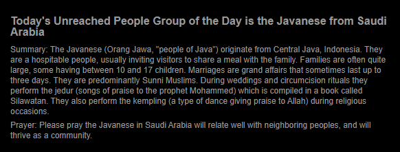

# MMM-DailyUnreachedPeopleGroup
This an extension for the [MagicMirror](https://github.com/MichMich/MagicMirror). It will display the "Unreached of the Day" from www.joshuaproject.net/pray/unreachedoftheday/today.

In order to make the API call to the Joshua Project API, you will need to [request an API key](https://api.joshuaproject.net/), which is typically delivered via email promptly.

### Preview


## Installation
1. Navigate into your MagicMirror's `modules` folder 
2. Execute `git clone https://github.com/MStoltzfus/MMM-DailyUnreachedPeopleGroup`
3. Navigate to newly created folder `MMM-DailyUnreachedPeopleGroup`
4. Execute `npm install`

## Using the module

To use this module, add it to the modules array in the `config/config.js` file:
````javascript
modules: [
	{
			module: 'MMM-DailyUnreachedPeopleGroup',
			position: 'bottom_bar',	// This can be any of the regions. Best result is in the bottom_bar as data displayed will most likely take multiple lines in a day.
			config: {
				apiKey: 'YOUR_APIKEY_HERE', //The API Key you recieved from api.joshuaproject.net.
				size: 'small' // default value is small, but can be changed. 
			}
		}
]
````

## Configuration options

The following properties can be configured:


<table width="100%">
	<!-- why, markdown... -->
	<thead>
		<tr>
			<th>Option</th>
			<th width="100%">Description</th>
		</tr>
	<thead>
	<tbody>
		<tr>
			<td><code>apiKey</code></td>
			<td>The API key you should have received after requesting one at https://api.joshuaproject.net/
			</td>
		</tr>
		<tr>
			<td><code>size</code></td>
			<td>Default size is small but it can be overriden with <code>xsmall</code>, <code>small</code> or <code>large</code>.</td>
		</tr>
	</tbody>
</table>

## Dependencies
- Access to the internet to download the unreached of the day data from www.joshuaproject.net.
- npm package `node-fetch`

## Credits
Special credits to [Arthur Garza](https://github.com/arthurgarzajr) and the rest of the team who developed the [MMM-DailyBibleVerse](https://github.com/arthurgarzajr/MMM-DailyBibleVerse), the module which was used as a base for this module.

Also special thanks to [Harlan Koehn](https://github.com/harlankoehn) and [Ryan Weaver](https://github.com/rdweaver) for letting me pick their brain about relatively simple coding questions, introducing me to ternary operators, and hashing through replacing 'request' with 'node-fetch', as the development of this module was my first forray into webdev.

The MIT License (MIT)
=====================

Copyright © 2021 Michael Stoltzfus

Permission is hereby granted, free of charge, to any person
obtaining a copy of this software and associated documentation
files (the “Software”), to deal in the Software without
restriction, including without limitation the rights to use,
copy, modify, merge, publish, distribute, sublicense, and/or sell
copies of the Software, and to permit persons to whom the
Software is furnished to do so, subject to the following
conditions:

The above copyright notice and this permission notice shall be
included in all copies or substantial portions of the Software.

**The software is provided “as is”, without warranty of any kind, express or implied, including but not limited to the warranties of merchantability, fitness for a particular purpose and noninfringement. In no event shall the authors or copyright holders be liable for any claim, damages or other liability, whether in an action of contract, tort or otherwise, arising from, out of or in connection with the software or the use or other dealings in the software.**
